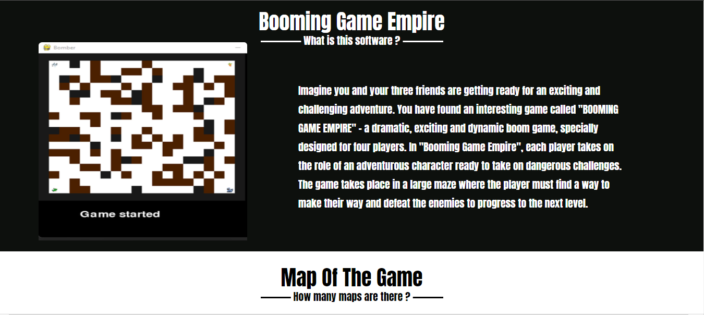
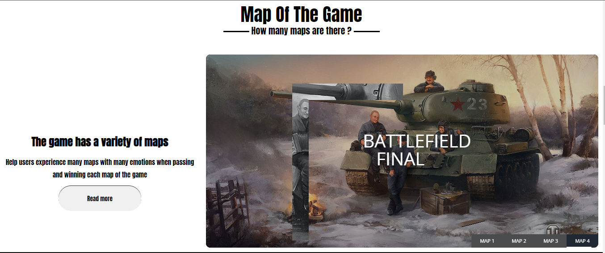

# BoomingGameEmpire

## Team  Members:
```bash
Saigon University ,Faculty of Information Technology ,Major in Software Engineering
ID          | Full Name
3120410278    Nguyen Thanh Quynh Linh
```
## Project Description:
This is the web page to describe a game built in Python
## Tech Stack Used:
```bash
Frontend: HTML , CSS , JS 
Python (Pygame , Socket , PyInstaller )
```
## [Project Demo Link](https://quynh-linh-it.github.io/BoomingGameEmpire.github.io)
## Some features of the site:
Home Page                   |                   Home Page 2
:---------------------------------:        |      :------------------------------:
  | 

HomePage 3                   |                   
:---------------------------------:        
 

### Make sure to star the repository if you find it helpful!
<a href="https://github.com/Quynh-Linh-IT/BoomingGameEmpire.github.io/stargazers"></a>
